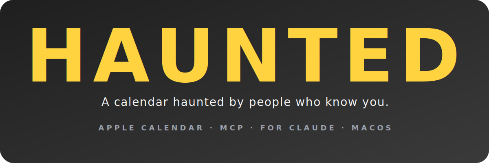
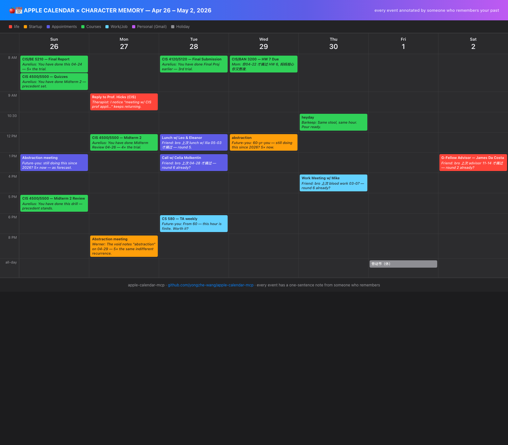

<p align="center"></p>
<h1 align="center">HAUNTED</h1>
<p align="center"><i>A calendar haunted by people who know you.</i></p>

<p align="center">
  <a href="LICENSE"></a>
  
  
  
</p>



> HAUNTED is an MCP server that lets the people who know you comment on every event in your Apple Calendar. Mom, your friend, your future self, your therapist, your bartender — they all leave one-line notes referencing your past calendar history. macOS-only, local-only, fully reversible.

[GitHub](https://github.com/yongzhe-wang/haunted-mcp) · [Docs](docs/) · [Changelog](CHANGELOG.md) · [Security](SECURITY.md) · [Contributing](CONTRIBUTING.md)

## Quickstart

### Claude Desktop / Claude Code

1. Add to your MCP config (`~/Library/Application Support/Claude/claude_desktop_config.json` or `~/.claude/claude_desktop_config.json`):

```json
{
  "mcpServers": {
    "haunted": {
      "command": "npx",
      "args": ["-y", "haunted-mcp"]
    }
  }
}
```

2. Grant Claude full access to Calendar.app: **System Settings → Privacy & Security → Automation → Claude → Calendar** (enable). See [docs/permissions.md](docs/permissions.md) if it doesn't appear.
3. Restart Claude.
4. Ask: _"What's on my calendar this week?"_

(Replace the `haunted` key with whatever name you want to call it in chat.)

## Customizing what HAUNTED says

The character system is the heart of HAUNTED — and it's designed to be customized. Three layers, in increasing order of effort:

1. **Pick from 12 built-in characters** (Mom, Friend, Coach, Therapist, Past-you, Future-you, Werner, Aurelius, Barkeep, Old friend, 夫子, Dog) — no setup required.
2. **Define inline custom characters per call** — pass `custom_characters: [...]` to `enrich_with_character_reminders` for a one-off render.
3. **Persist your character roster** at `~/.apple-calendar-mcp/characters.json` — every future call merges these in alongside the built-ins.

Each character has a `directive` — a short system prompt for that voice. Tell Claude _exactly_ who that person is to you, what they care about, what they would notice. The directive is the lever for tuning what gets said. See [Define your own characters](#define-your-own-characters) below for the full schema.

## What HAUNTED does

- **15 tools** across 4 categories (CRUD, Analytics, Personas, Character Memory)
- **12 built-in relational characters** — bring your own with `~/.apple-calendar-mcp/characters.json`
- **Persistent calendar memory** across years; commentary references specific past events
- **Fully reversible** — every mutation embeds a sentinel-marked backup; revert with one tool call

[See docs/examples.md for 8 real prompt → result walk-throughs.](docs/examples.md)

## Tools (grouped)

### CRUD

- `list_calendars` — every calendar (name + uid + account)
- `list_events` — events in a window across one or more calendars
- `search_events` — substring/CJK-aware search across calendars
- `create_event` — make an event
- `update_event` — modify an event by uid (in-place or cross-calendar)
- `delete_event` — delete an event by uid

### Analytics

- `time_per_calendar` — total timed-event duration per calendar over a window
- `mortality_overlay` — per-event % of an N-year waking life consumed

### Personas

- `list_events_in_persona` — wrap events with one persona's directive (Werner Herzog, Hemingway, etc.)
- `list_events_in_mixed_personas` — assign 36 distinct voices, one per event, with thematic mapping (DMV→Kafka, exam→Plath, recurring→noir detective)

### Character Memory

- `seed_calendar_memory` — populate `~/.apple-calendar-mcp/memory.json` from past N years
- `query_calendar_memory` — read memory by person / topic / date / calendar / similarity
- `enrich_with_character_reminders` — for each event, attach a relational character + 3 memory_context items + a directive
- `apply_character_reminders` — mutate Calendar.app titles with Claude-composed sentences (with backup)
- `revert_character_reminders` — restore originals from the embedded backup block

[Full reference: docs/tools.md](docs/tools.md)

## Calendar Memory & Character Reminders

A separate, opt-in track from the personas/voices/mortality stack. The premise: your calendar is more useful as a memory device than as a literary scratchpad. Instead of rewriting every title in Werner Herzog's voice, this track appends ONE sentence after each original title — pretending to be a reminder from a relational character (Mom, Friend, Coach, Therapist, Past-you, Future-you, etc.) — and grounds that sentence in your real prior calendar events.

Five tools. The MCP server has no LLM; sentence composition still happens at Claude (the client). The server provides the character directive, the memory_context, and a mutation/revert path.

1. **`seed_calendar_memory`** — fans out across writable calendars and snapshots events into `~/.apple-calendar-mcp/memory.json` (`mode 0600`, parent dir `0700`). Defaults to the last five years. Idempotent: re-seeding merges by UID, latest write wins, observations are unioned across writes.
2. **`query_calendar_memory`** — read access. `query_type ∈ { by_person, by_topic, by_date_range, by_calendar, similar_to, all }`. The `similar_to` query takes a synthetic event and ranks past events by token-overlap (with a small bonus for same-calendar matches), newest-first.
3. **`enrich_with_character_reminders`** — fetches events in a window, picks a relational character per event by trigger overlap (deterministic seeded fallback when nothing matches), and attaches `memory_context_items` from `recentSimilarEvents`. Returns each event with `character_label`, `character_directive`, `memory_context`, and a `rewrite_instruction`, plus a top-level `rewrite_template` describing the format Claude must emit.
4. **`apply_character_reminders`** — Claude composes one sentence per event and posts back `{ uid, calendar, new_title, new_notes? }` items. The tool stores the original `title` / `notes` / `location` inside the event's notes between two sentinel lines (`---ORIGINAL_TITLE_BACKUP_v1---` / `---END_ORIGINAL_TITLE_BACKUP_v1---`), and ALSO writes a JSON snapshot to `~/.apple-calendar-mcp/last_apply_backup_<unix_ts>.json`. `dry_run: true` returns what would change without writing.
5. **`revert_character_reminders`** — finds every event whose notes contain the backup sentinel within the requested window (defaults to roughly `-5y..+1y` if omitted) and restores the original title/notes/location, stripping the backup block.

Format on the calendar after `apply_character_reminders` runs:

```text
{ORIGINAL_TITLE} — {character_label}: {one_sentence_referencing_memory}
```

Built-in character pool (12 characters): `Mom`, `Friend`, `Coach`, `Therapist`, `Past-you`, `Future-you`, `Werner`, `Aurelius`, `Barkeep`, `Old friend`, `夫子`, `Dog`. See `src/characters.ts` for triggers and directives.

## Define your own characters

The built-in pool is a starting point. The point of this system is that _you_ define the characters that would actually leave you a note — your boss, your therapist, your dead grandmother, your fourth-grade teacher, the friend who keeps asking when you're moving back home. Two ways, both no-fork:

**1. Persistent config file.** Drop a JSON file at `~/.apple-calendar-mcp/characters.json` (created the same way as `memory.json`: parent dir `0700`, file `0600`). Every `enrich_with_character_reminders` call automatically merges these in alongside the built-ins.

```json
{
  "version": 1,
  "characters": [
    {
      "name": "My Boss",
      "short_label": "Boss",
      "directive": "Terse, slightly impatient, uses my last name. Reference one memory_context item with a 'remember when' or 'we agreed' phrasing. ONE sentence.",
      "triggers": ["meeting", "review", "1:1", "deadline"]
    },
    {
      "name": "Grandma",
      "short_label": "奶奶",
      "directive": "Gentle Cantonese grandmother, mixes Cantonese + English. Worries about whether you ate. Reference a past meal or family event from memory_context. ONE sentence.",
      "triggers": ["dinner", "lunch", "family", "home", "holiday"]
    }
  ]
}
```

Field reference: `name` (unique, ≤64 chars), `short_label` (≤16 chars, embedded in event title), `directive` (≤300 chars, must mention memory), `triggers` (lowercase substrings matched against event title/notes/location), optional `default: true` for fallback when nothing matches.

**2. Inline per-call.** Pass `custom_characters` directly in the tool call — useful for one-off renderings or when the calling agent is curating a pool dynamically. Up to 30 entries.

```json
{
  "start_date": "2026-05-01T00:00:00Z",
  "end_date": "2026-05-08T00:00:00Z",
  "custom_characters": [
    {
      "name": "Younger Sister",
      "short_label": "Sister",
      "directive": "Pesters you with sibling-knowledge — lowercase, dry. Reference a memory_context item only she would notice (the time you skipped a flight, lied about gym attendance, etc.). ONE sentence.",
      "triggers": ["family", "flight", "gym", "home"]
    }
  ],
  "character_pool": ["Younger Sister", "Mom"],
  "use_persistent_config": true
}
```

**Conflict resolution by `name`:** inline > persistent config > built-in. So `custom_characters: [{ "name": "Mom", ... }]` overrides the built-in Mom for that call. Set `use_persistent_config: false` to ignore the on-disk file (e.g. for fully reproducible runs across machines).

## Configuration

- **Memory:** `~/.apple-calendar-mcp/memory.json` (mode `0600`)
- **Custom characters:** `~/.apple-calendar-mcp/characters.json` (mode `0600`)
- **Snapshots:** `~/.apple-calendar-mcp/last_apply_backup_*.json`

The data directory path is **kept** at `~/.apple-calendar-mcp/` across renames (HECKLE in v0.2.0, HAUNTED in v0.2.1), so existing users don't lose memory or custom characters.

[See docs/permissions.md for macOS TCC setup.](docs/permissions.md)

## Architecture

stdio transport, AppleScript-only, no network, no native bindings. Three-phase tool pattern: pure script-builder + pure parser + async wrapper. Calendar.app `uid` is the event identifier. RS/US separators for parse output. Escape discipline locked into `escapeAppleScriptString`.

[Full architecture: docs/architecture.md](docs/architecture.md). Decision records in [docs/adr/](docs/adr/).

## Security

Local-only. Threat surface: AppleScript injection (mitigated by escape discipline), stdio transport corruption (stderr-only logs), Calendar.app TCC scope (full read/write — be aware).

[Threat model: SECURITY.md](SECURITY.md)

## Development

```bash
git clone https://github.com/yongzhe-wang/haunted-mcp.git
cd haunted-mcp
pnpm install
pnpm test
pnpm build
pnpm check
```

- `pnpm dev` — rebuild on change
- `pnpm test` — run the unit suite (no Calendar.app required)
- `pnpm lint` / `pnpm lint:fix` — oxlint
- `pnpm format` / `pnpm format:check` — oxfmt
- `pnpm typecheck` — `tsc --noEmit`
- `pnpm knip` — unused code/deps
- `pnpm check` — typecheck + lint + format:check + knip (same gate as CI)

## Status & roadmap

v0.2.1 — current. Renamed from `apple-calendar-mcp` → `heckle-mcp` → `haunted-mcp`. 15 tools, 265 tests, all gates green on macos-latest.

Formerly published as `apple-calendar-mcp` and `heckle-mcp`. The package was renamed to `haunted-mcp` in v0.2.1; older names are no longer maintained.

## Contributing

[See CONTRIBUTING.md](CONTRIBUTING.md). Drive-bys welcome. Add an injection-payload test if you touch escape paths.

## License

MIT © Yongzhe Wang 2026

---

_Haunted was built in one day during a hackathon, then iterated for two more. The character memory system was the moment it stopped being a calendar and became something stranger — every event narrated by a voice from your past._
