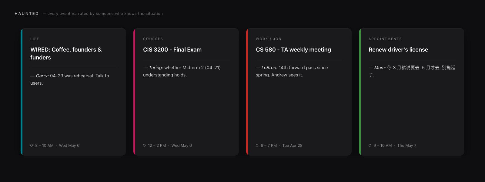

<p align="center"></p>

<h1 align="center">🎭 HAUNTED — Apple Calendar MCP for Claude</h1>
<p align="center"><i>A calendar haunted by people who know you. The open-source Apple Calendar MCP server for Claude Desktop, Claude Code, and any MCP-compatible client.</i></p>

<p align="center">
  <a href="LICENSE"></a>
  
  <a href="https://modelcontextprotocol.io"></a>
  
  <a href="https://www.npmjs.com/package/haunted-apple-calendar-mcp"></a>
</p>

<p align="center">
  💬 open Claude Code · 📩 paste your event · 🔌 MCP · 🎭 characters as skills · 📅 calendar item · ☁️ sync everywhere
</p>



> **HAUNTED** is an open-source **Apple Calendar MCP server** for **Claude Desktop**, **Claude Code**, and any [Model Context Protocol](https://modelcontextprotocol.io) client. It gives Claude full read/write access to your **macOS Calendar.app** via [AppleScript](https://developer.apple.com/library/archive/documentation/AppleScript/Conceptual/AppleScriptLangGuide/) — plus 12 relational characters and 16 synthetic distillers (Mom, Future-you, Garry Tan, Alan Turing, LeBron James, Ian (Hearts2Hearts), …) that comment on every calendar event with one-line reminders grounded in your past calendar history. macOS-only, local-only, fully reversible.

[GitHub](https://github.com/yongzhe-wang/haunted-apple-calendar-mcp) · [npm](https://www.npmjs.com/package/haunted-apple-calendar-mcp) · [Docs](docs/) · [Changelog](CHANGELOG.md) · [Security](SECURITY.md) · [Contributing](CONTRIBUTING.md)

## Table of contents

- [What is HAUNTED?](#what-is-haunted)
- [How to install Apple Calendar MCP for Claude](#how-to-install-apple-calendar-mcp-for-claude)
- [Customizing what HAUNTED says](#customizing-what-haunted-says)
- [Tools — 17 MCP server tools for macOS Calendar](#tools--17-mcp-server-tools-for-macos-calendar)
- [Calendar Memory & Character Reminders](#calendar-memory--character-reminders)
- [Define your own characters](#define-your-own-characters)
- [Distillers — synthetic voices of named people](#distillers--synthetic-voices-of-named-people)
- [Configuration](#configuration)
- [How HAUNTED works (architecture)](#how-haunted-works-architecture)
- [Security](#security)
- [Development](#development)
- [FAQ — Apple Calendar + MCP + Claude integration](#faq--apple-calendar--mcp--claude-integration)

## What is HAUNTED?

HAUNTED is an **Apple Calendar MCP server**: a small Node.js binary that speaks the [Model Context Protocol](https://modelcontextprotocol.io) over stdio and exposes your **macOS Calendar.app** to Claude. It is open-source, local-only, has no network calls, and ships 17 MCP tools across CRUD, analytics, personas, character memory, and distillers. If you want Claude to actually read and write the calendar on your Mac — and to do it with personality — this is the MCP server for that.

## How to install Apple Calendar MCP for Claude

### Claude Desktop / Claude Code

1. Add to your MCP config (`~/Library/Application Support/Claude/claude_desktop_config.json` or `~/.claude/claude_desktop_config.json`):

```json
{
  "mcpServers": {
    "haunted": {
      "command": "npx",
      "args": ["-y", "haunted-apple-calendar-mcp"]
    }
  }
}
```

2. Grant Claude full access to **Calendar.app**: **System Settings → Privacy & Security → Automation → Claude → Calendar** (enable). See [docs/permissions.md](docs/permissions.md) if it doesn't appear.
3. Restart Claude.
4. Ask: _"What's on my calendar this week?"_

(Replace the `haunted` key with whatever name you want to call the MCP server in chat.)

## Customizing what HAUNTED says

The character system is the heart of HAUNTED — and it's designed to be customized. Three layers, in increasing order of effort:

1. **Pick from 12 built-in characters** (Mom, Friend, Coach, Therapist, Past-you, Future-you, Werner, Aurelius, Barkeep, Old friend, 夫子, Dog) — no setup required.
2. **Define inline custom characters per call** — pass `custom_characters: [...]` to `enrich_with_character_reminders` for a one-off render.
3. **Persist your character roster** at `~/.apple-calendar-mcp/characters.json` — every future call merges these in alongside the built-ins. (The `~/.apple-calendar-mcp/` data path is **preserved across renames** so existing users keep their memory.)

Each character has a `directive` — a short system prompt for that voice. Tell Claude _exactly_ who that person is to you, what they care about, what they would notice. The directive is the lever for tuning what gets said. See [Define your own characters](#define-your-own-characters) below for the full schema.

## What HAUNTED does

- **17 MCP tools** across 5 categories (CRUD, Analytics, Personas, Character Memory, Distillers)
- **12 built-in relational characters** — bring your own with `~/.apple-calendar-mcp/characters.json`
- **16 built-in distillers** — synthetic voices of specific named people (Garry Tan, Naval, Karpathy, Ian (Hearts2Hearts), …)
- **Persistent calendar memory** across years; commentary references specific past events
- **Fully reversible** — every mutation embeds a sentinel-marked backup; revert with one tool call

[See docs/examples.md for 8 real prompt → result walk-throughs.](docs/examples.md)

## The 9-stage HAUNTED pipeline

HAUNTED v0.5 reframes memory as a **user model** that grows from every input — screenshots, messages, URLs, free text — not just past calendar events. The MCP server provides 5 new tools that orchestrate a single 9-stage flow:

```
0. INPUT (screenshot / message / URL / free text)
1. EXTRACT          → extract_entities_from_input
2. RESEARCH         → research_entities → (Claude WebSearch/WebFetch) → cache_research_facts
3. MEMORY UPDATE    → update_memory_from_input
4. CALENDAR ACTION  → create_event / update_event / delete_event
5. CHARACTER SELECT → enrich_with_character_reminders (existing logic)
6. CONTEXT BUILD    → query_full_context_for_event
7. COMPOSE          → Claude voices the per-event sentence (anti-fabrication enforced)
8. APPLY            → apply_character_reminders
9. FEEDBACK LOOP    → mutated event back to memory
```

Memory schema v2 keys: `events`, `people`, `topics`, `user_notes`, `external_facts`. v1 files load unchanged. See [docs/architecture.md](docs/architecture.md) for the full diagram.

### Case study: heyday

A real stress test of Stages 2–3, run on a single ambiguous calendar entry.

**Input.** The user has one event titled `heyday` (Thu Apr 30, 10:30 AM – 5:45 PM, Courses calendar). Memory has 0 prior `heyday` entries — the word looks like a generic English noun ("the heyday of jazz"). The seven-hour block is the only signal that something specific is happening.

**Without web research (old behavior).** The voice (夫子) has nothing to anchor on, so it falls back to a placeholder:

```
heyday — 夫子: 子曰: heyday 初见于此, 君子慎其始, 不在数, 在精专.
```

A generic Confucian platitude. No information. The user could write that themselves.

**With web research (new pipeline, Stages 2–3).** Stage 1 extracts `heyday` as a topic. Stage 2 returns `cached_facts: {}` and `needs_research: ["heyday"]`. Claude (the orchestrator) runs `WebSearch("heyday upenn")` and surfaces the actual referent: **Hey Day** at the University of Pennsylvania — the junior-to-senior moving-up tradition since 1916, marked by red T-shirts, straw hats, canes, and a three-question pass-fail "exam" delivered by the Penn President. Claude calls `cache_research_facts` to persist that summary (7-day TTL).

**Memory update (Stage 3).** `memory.topics["Hey Day"]` now carries an `external_summary` describing the tradition. On every future event whose title overlaps, that summary is in scope.

**Voice composition (Stage 7).** Same 夫子 voice, now grounded:

```
heyday — 夫子: 子曰: 三年学问, 一日礼成. 红衫戴冠, 君子志学之毕也. 1916 至今同此礼.
```

Translation: _"Confucius said: three years of study, one day of ceremony complete. Red tunic, capped — the gentleman marks the end of his studentship. Same rite since 1916."_

Same character. Different information density. Every claim — three years, the red tunic, the cap, the 1916 date — traces back to the cached external fact. Nothing invented.

**Takeaway.** _Voice is the wrapper; the facts come from your past calendar (memory) and from web research. Without facts, voice has nothing to say._

## Why HAUNTED knows things

A character only sounds knowing when there is something to know. HAUNTED draws on four layered sources of context, all merged at Stage 6 (`query_full_context_for_event`) and handed to the LLM at Stage 7 for composition:

1. **Memory — your past calendar history.** Events you've actually had, who showed up, which topics recur. Seeded by `seed_calendar_memory` from up to five years back.
2. **External facts — web-researched domain knowledge.** What is heyday? Who is Lingjie Liu? What is CS 580? Cached in `external_facts` with a 7-day TTL, refreshed on demand.
3. **People records.** Named humans across all inputs — bios, roles, relationships — accumulated as you give Claude screenshots and messages.
4. **User notes — things you've told Claude in chat.** Verbatim user statements with a source label, persisted so they outlast a single session.

All four feed the Stage 6 context build. Stage 7 composition reads from that bundle and composes one grounded sentence per event, in the assigned voice. If the bundle is empty, the LLM is instructed to say less, not invent more.

## Tools — 22 MCP server tools for macOS Calendar

### CRUD

- `list_calendars` — every calendar (name + uid + account)
- `list_events` — events in a window across one or more calendars
- `search_events` — substring/CJK-aware search across calendars
- `create_event` — make an event
- `update_event` — modify an event by uid (in-place or cross-calendar)
- `delete_event` — delete an event by uid

### Analytics

- `time_per_calendar` — total timed-event duration per calendar over a window
- `mortality_overlay` — per-event % of an N-year waking life consumed (memento mori)

### Personas

- `list_events_in_persona` — wrap events with one persona's directive (Werner Herzog, Hemingway, etc.)
- `list_events_in_mixed_personas` — assign 36 distinct voices, one per event, with thematic mapping (DMV→Kafka, exam→Plath, recurring→noir detective)

### Character Memory

- `seed_calendar_memory` — populate `~/.apple-calendar-mcp/memory.json` from past N years
- `query_calendar_memory` — read memory by person / topic / date / calendar / similarity
- `enrich_with_character_reminders` — for each event, attach a relational character + 3 memory_context items + a directive
- `apply_character_reminders` — mutate Calendar.app titles with Claude-composed sentences (with backup)
- `revert_character_reminders` — restore originals from the embedded backup block

### Distillers

- `list_distillers` — enumerate synthetic voices distilled from public material of named people (Garry Tan, PG, Naval, Karpathy, Steve Jobs, Bezos, Munger, Alan Turing, LeBron James, Hilary Hahn, …)
- `distill_voice_from_text` — supply a corpus, get a draft Distiller object back for the LLM to fill in

### 9-stage pipeline (v0.5)

- `extract_entities_from_input` — Stage 1: structured extraction schema (events / people / topics / user statements / intent)
- `research_entities` — Stage 2: cached external_facts + research directive for Claude to act on with WebSearch/WebFetch
- `cache_research_facts` — Stage 2 follow-up: persist Claude's web findings (7-day TTL)
- `update_memory_from_input` — Stage 3: bulk-merge extraction results into memory v2
- `query_full_context_for_event` — Stage 6: full context bundle (memory + people + topics + external facts + user notes) for one event

[Full reference: docs/tools.md](docs/tools.md)

## Calendar Memory & Character Reminders

A separate, opt-in track from the personas/voices/mortality stack. The premise: your calendar is more useful as a memory device than as a literary scratchpad. Instead of rewriting every title in Werner Herzog's voice, this track appends ONE sentence after each original title — pretending to be a reminder from a relational character (Mom, Friend, Coach, Therapist, Past-you, Future-you, etc.) — and grounds that sentence in your real prior calendar events.

Five tools. The MCP server has no LLM; sentence composition still happens at Claude (the client). The server provides the character directive, the memory_context, and a mutation/revert path.

1. **`seed_calendar_memory`** — fans out across writable calendars and snapshots events into `~/.apple-calendar-mcp/memory.json` (`mode 0600`, parent dir `0700`). Defaults to the last five years. Idempotent: re-seeding merges by UID, latest write wins, observations are unioned across writes.
2. **`query_calendar_memory`** — read access. `query_type ∈ { by_person, by_topic, by_date_range, by_calendar, similar_to, all }`. The `similar_to` query takes a synthetic event and ranks past events by token-overlap (with a small bonus for same-calendar matches), newest-first.
3. **`enrich_with_character_reminders`** — fetches events in a window, picks a relational character per event by trigger overlap (deterministic seeded fallback when nothing matches), and attaches `memory_context_items` from `recentSimilarEvents`. Returns each event with `character_label`, `character_directive`, `memory_context`, and a `rewrite_instruction`, plus a top-level `rewrite_template` describing the format Claude must emit.
4. **`apply_character_reminders`** — Claude composes one sentence per event and posts back `{ uid, calendar, new_title, new_notes? }` items. The tool stores the original `title` / `notes` / `location` inside the event's notes between two sentinel lines (`---ORIGINAL_TITLE_BACKUP_v1---` / `---END_ORIGINAL_TITLE_BACKUP_v1---`), and ALSO writes a JSON snapshot to `~/.apple-calendar-mcp/last_apply_backup_<unix_ts>.json`. `dry_run: true` returns what would change without writing.
5. **`revert_character_reminders`** — finds every event whose notes contain the backup sentinel within the requested window (defaults to roughly `-5y..+1y` if omitted) and restores the original title/notes/location, stripping the backup block.

Format on the calendar after `apply_character_reminders` runs:

```text
{ORIGINAL_TITLE} — {character_label}: {one_sentence_referencing_memory}
```

Built-in character pool (12 characters): `Mom`, `Friend`, `Coach`, `Therapist`, `Past-you`, `Future-you`, `Werner`, `Aurelius`, `Barkeep`, `Old friend`, `夫子`, `Dog`. See `src/characters.ts` for triggers and directives.

## Define your own characters

The built-in pool is a starting point. The point of this system is that _you_ define the characters that would actually leave you a note — your boss, your therapist, your dead grandmother, your fourth-grade teacher, the friend who keeps asking when you're moving back home. Two ways, both no-fork:

**1. Persistent config file.** Drop a JSON file at `~/.apple-calendar-mcp/characters.json` (created the same way as `memory.json`: parent dir `0700`, file `0600`). Every `enrich_with_character_reminders` call automatically merges these in alongside the built-ins.

```json
{
  "version": 1,
  "characters": [
    {
      "name": "My Boss",
      "short_label": "Boss",
      "directive": "Terse, slightly impatient, uses my last name. Reference one memory_context item with a 'remember when' or 'we agreed' phrasing. ONE sentence.",
      "triggers": ["meeting", "review", "1:1", "deadline"]
    },
    {
      "name": "Grandma",
      "short_label": "奶奶",
      "directive": "Gentle Cantonese grandmother, mixes Cantonese + English. Worries about whether you ate. Reference a past meal or family event from memory_context. ONE sentence.",
      "triggers": ["dinner", "lunch", "family", "home", "holiday"]
    }
  ]
}
```

Field reference: `name` (unique, ≤64 chars), `short_label` (≤16 chars, embedded in event title), `directive` (≤300 chars, must mention memory), `triggers` (lowercase substrings matched against event title/notes/location), optional `default: true` for fallback when nothing matches.

**2. Inline per-call.** Pass `custom_characters` directly in the tool call — useful for one-off renderings or when the calling agent is curating a pool dynamically. Up to 30 entries.

```json
{
  "start_date": "2026-05-01T00:00:00Z",
  "end_date": "2026-05-08T00:00:00Z",
  "custom_characters": [
    {
      "name": "Younger Sister",
      "short_label": "Sister",
      "directive": "Pesters you with sibling-knowledge — lowercase, dry. Reference a memory_context item only she would notice (the time you skipped a flight, lied about gym attendance, etc.). ONE sentence.",
      "triggers": ["family", "flight", "gym", "home"]
    }
  ],
  "character_pool": ["Younger Sister", "Mom"],
  "use_persistent_config": true
}
```

**Conflict resolution by `name`:** inline > persistent config > built-in. So `custom_characters: [{ "name": "Mom", ... }]` overrides the built-in Mom for that call. Set `use_persistent_config: false` to ignore the on-disk file (e.g. for fully reproducible runs across machines).

## Distillers — synthetic voices of named people

Where Characters are relational archetypes ("Mom", "Coach", "Past-you"), **Distillers** are synthetic voices distilled from the public writing, talks, and tweets of specific named people. Use them when you want a calendar entry that sounds like Garry Tan would have written it, or Paul Graham, or Naval, or Steve Jobs.

Built-in pool (16 distillers, all carry the disclaimer "Synthetic voice distilled from public material. Not endorsed by the named individual."):

`Garry Tan`, `Paul Graham`, `Naval Ravikant`, `Sam Altman`, `Steve Jobs`, `Andrej Karpathy`, `Marc Andreessen`, `Jeff Bezos`, `Charlie Munger`, `Brian Chesky`, `Joan Didion`, `Alan Turing` (CS history). K-pop / performers: `Hilary Hahn` (violinist discipline), `LeBron James` (athlete leadership), `Ian (Hearts2Hearts)` (K-pop idol). Plus an `Old Founder` archetype for fallback.

Use them in `enrich_with_character_reminders` via `distiller_pool`:

```json
{
  "start_date": "2026-05-01T00:00:00Z",
  "end_date": "2026-05-08T00:00:00Z",
  "distiller_pool": ["Garry Tan", "Naval Ravikant"],
  "character_pool": ["Coach"]
}
```

Distillers and characters merge into one assignment pool; conflicts resolve by name with inline > persistent > built-in. Persist your own at `~/.apple-calendar-mcp/distillers.json` (`{ "version": 1, "distillers": [...] }`, parent dir `0700`, file `0600`). To distill yourself or someone else from a text corpus, call `distill_voice_from_text` — the MCP server has no LLM, so the tool returns a placeholder Distiller and instructions for the calling LLM to fill in `directive` and `signature_phrases`.

Every Distiller carries an `attribution` field, every directive ends with "Synthetic voice; not endorsed.", and `list_distillers` repeats the disclaimer at the envelope level.

## Configuration

- **Memory:** `~/.apple-calendar-mcp/memory.json` (mode `0600`)
- **Custom characters:** `~/.apple-calendar-mcp/characters.json` (mode `0600`)
- **Custom distillers:** `~/.apple-calendar-mcp/distillers.json` (mode `0600`)
- **Snapshots:** `~/.apple-calendar-mcp/last_apply_backup_*.json`

The data directory path is **kept** at `~/.apple-calendar-mcp/` across renames (HECKLE in v0.2.0, HAUNTED in v0.2.1, `haunted-apple-calendar-mcp` in v0.4.0), so existing users don't lose memory or custom characters.

[See docs/permissions.md for macOS TCC setup.](docs/permissions.md)

## How HAUNTED works (architecture)

stdio transport, AppleScript-only, no network, no native bindings. Three-phase tool pattern: pure script-builder + pure parser + async wrapper. Calendar.app `uid` is the event identifier. RS/US separators for parse output. Escape discipline locked into `escapeAppleScriptString`.

[Full architecture: docs/architecture.md](docs/architecture.md). Decision records in [docs/adr/](docs/adr/).

## Security

Local-only. No network. Threat surface: AppleScript injection (mitigated by escape discipline), stdio transport corruption (stderr-only logs), Calendar.app TCC scope (full read/write — be aware).

[Threat model: SECURITY.md](SECURITY.md)

## Development

```bash
git clone https://github.com/yongzhe-wang/haunted-apple-calendar-mcp.git
cd haunted-apple-calendar-mcp
pnpm install
pnpm test
pnpm build
pnpm check
```

- `pnpm dev` — rebuild on change
- `pnpm test` — run the unit suite (no Calendar.app required)
- `pnpm lint` / `pnpm lint:fix` — oxlint
- `pnpm format` / `pnpm format:check` — oxfmt
- `pnpm typecheck` — `tsc --noEmit`
- `pnpm knip` — unused code/deps
- `pnpm check` — typecheck + lint + format:check + knip (same gate as CI)

## FAQ — Apple Calendar + MCP + Claude integration

### How do I connect Apple Calendar to Claude?

Install this Apple Calendar MCP server with `npx -y haunted-apple-calendar-mcp`, register it in your `claude_desktop_config.json` under `mcpServers`, then grant Claude **Calendar Automation** in macOS System Settings → Privacy & Security → Automation. Restart Claude. Ask "what's on my calendar this week?" and Claude will use the MCP tools to read your macOS Calendar.app directly.

### What is an MCP server?

An MCP server is a small program that speaks the [Model Context Protocol](https://modelcontextprotocol.io) — Anthropic's open standard for letting LLMs call tools. HAUNTED is an MCP server for Apple Calendar: it exposes 17 calendar tools (list, search, create, update, delete, plus character/memory/distiller tools) so Claude can read and write your macOS Calendar.app.

### Does this work with Claude Desktop AND Claude Code?

Yes. Both Claude Desktop and Claude Code load MCP servers from `claude_desktop_config.json`. The same config block works for both. Any other MCP-compatible client (Cline, Continue, Zed, custom agents) can also use HAUNTED — it's a plain stdio MCP server.

### Can I add my own characters or voices?

Yes — that's the point. Drop a JSON file at `~/.apple-calendar-mcp/characters.json` (or `distillers.json`) and HAUNTED merges your roster into every `enrich_with_character_reminders` call alongside the 12 built-in characters and 16 built-in distillers. You can also pass `custom_characters: [...]` inline per tool call. See [Define your own characters](#define-your-own-characters).

### Is HAUNTED safe? Does it call any external API?

No external API. No network. HAUNTED only spawns `osascript` (the macOS AppleScript runtime) and reads/writes files in `~/.apple-calendar-mcp/` (mode `0600`). All event data stays on your Mac. The threat surface — AppleScript injection, stdio corruption, Calendar.app TCC scope — is documented in [SECURITY.md](SECURITY.md).

### How do I revert if I don't like the changes Claude made to my calendar?

Every `apply_character_reminders` call writes a sentinel-marked backup of the original title/notes/location into the event's notes field, _and_ a JSON snapshot to `~/.apple-calendar-mcp/last_apply_backup_<unix_ts>.json`. Call `revert_character_reminders` with the same date window and HAUNTED restores the originals from the embedded backup block. Fully reversible.

### Why does HAUNTED require macOS?

Because it talks to **Apple Calendar.app** through **AppleScript** (`osascript`). AppleScript is a macOS-only IPC mechanism. There is no equivalent path on Linux or Windows, so the package declares `"os": ["darwin"]` in `package.json`.

### Does it work with Google Calendar, Outlook, or other calendars?

Indirectly — if you've added your Google Calendar, Outlook, or iCloud account inside macOS Calendar.app, HAUNTED reads and writes through Calendar.app, so events in those accounts are visible. HAUNTED itself does not call Google/Microsoft APIs and has no concept of those services beyond the Calendar.app account name.

## Status & roadmap

v0.4.0 — current. Renamed for SEO from `apple-calendar-mcp` → `heckle-mcp` → `haunted-mcp` → `haunted-apple-calendar-mcp`. 17 tools, 265 tests, all gates green on macos-latest.

Formerly published as `apple-calendar-mcp`, `heckle-mcp`, and `haunted-mcp`. The package is now `haunted-apple-calendar-mcp` as of v0.4.0; older names are no longer maintained but the data directory `~/.apple-calendar-mcp/` is preserved.

## Contributing

[See CONTRIBUTING.md](CONTRIBUTING.md). Drive-bys welcome. Add an injection-payload test if you touch escape paths.

## License

MIT © Yongzhe Wang 2026

---

_HAUNTED — the Apple Calendar MCP server for Claude — was built in one day during a hackathon, then iterated for two more. The character memory system was the moment it stopped being a calendar and became something stranger — every event narrated by a voice from your past._

[⬆ back to top](#-haunted--apple-calendar-mcp-for-claude)
